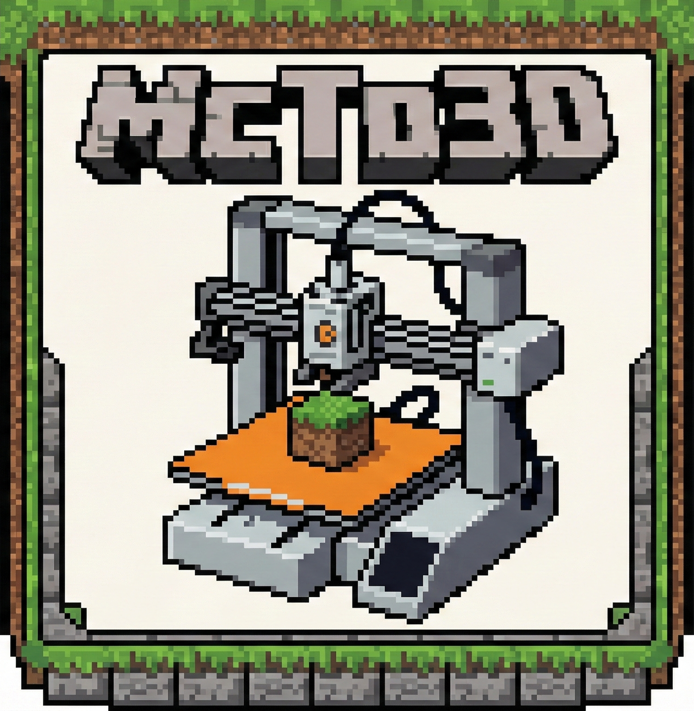

# 
 
<b>McTo3D</b>
 
<i>Turn Minecraft into a powerful CAD tool for 3D printing.</i>

 

> **⚠️ Public Beta:** This mod is currently in active development. While the core features work, please encounter bugs and back up your worlds.

---

## 📖 About

Hi! I'm a solo developer passionate about 3D printing and Minecraft. I created **McTo3D** to bridge the gap between these two worlds, allowing you to easily export your in-game creations as printable 3D files.

Currently developed for **Fabric**, this mod aims to be the simplest way to get from blocks to slicing software.

## ✨ Current Features (v0.1.0-beta)

### 🛠️ Intuitive Selection
* **Wand Selection:** Just grab a **Golden Hoe**. Left-click for Position 1, Right-click for Position 2.
* **Commands:** Use `/pos1` and `/pos2` for precise targeting at your feet.

### 📐 Smart Manipulation
Need to capture the roof or basement without re-selecting everything?
* **Vertical Expansion:** Use `/expand <amount>` (e.g., `/expand 10` to go up, `/expand -5` to go down).

### 💾 Powerful Export Engine
The export engine is fully functional and supports multiple workflows:
* **Raw Mode:** Exports clean geometry (OBJ), perfect for sculpting or single-color prints.
* **✅ Texture & Color Support:** The engine correctly exports Minecraft textures and colors.
* **AMS Ready:** Optimized for multi-material printers like the **Bambu Lab AMS** for full-color printing directly from the game.

---

## 📥 Installation

1.  Install **Fabric Loader** for your Minecraft version.
2.  **Important:** Download and install **Fabric API** (It is required for the mod to work).
3.  Download the latest `McTo3D-x.x.x.jar` from the releases tab.
4.  Drop the `.jar` file into your Minecraft `.minecraft/mods` folder.
5.  Launch the game!

## 🎥 Tutorials & Demos

Need a visual guide? Want to see how to install the mod or watch it in action?
Check out my TikTok for step-by-step tutorials, dev logs, and print showcases!

👉 **[Watch the Tutorials on TikTok (@gotr07)](https://www.tiktok.com/@gotr07?lang=en)**

---

## 🚀 Quick Start Guide

1.  Equip a **Golden Hoe**.
2.  Select two opposite corners of your build (Left/Right click).
3.  (Optional) Type `/expand 5` if you missed the roof.
4.  Type the command `/export3d`.
5.  Go to your `.minecraft/exports` folder to find your 3D file!

---

## 🔮 Roadmap & Future Plans

I have big plans for McTo3D! Here is what I am working on next:

* 🚀 **Export Optimization:** Making file generation even faster and lighter.
* 📏 **Custom Scale:** Configurable settings to define real-world scale (e.g., `1 block = 1mm` or `1cm`).
* 📥 **Import3D:** Working on the ability to import external STL/OBJ files *into* Minecraft using blocks.
* ✨ And implementing cool suggestions from the community.

---

## 🐛 Issues & Feedback

As this is a Beta release, your feedback is crucial. If you find a bug or have a suggestion, please open an issue in the **Issues** tab on GitHub.

*Happy Printing!*
